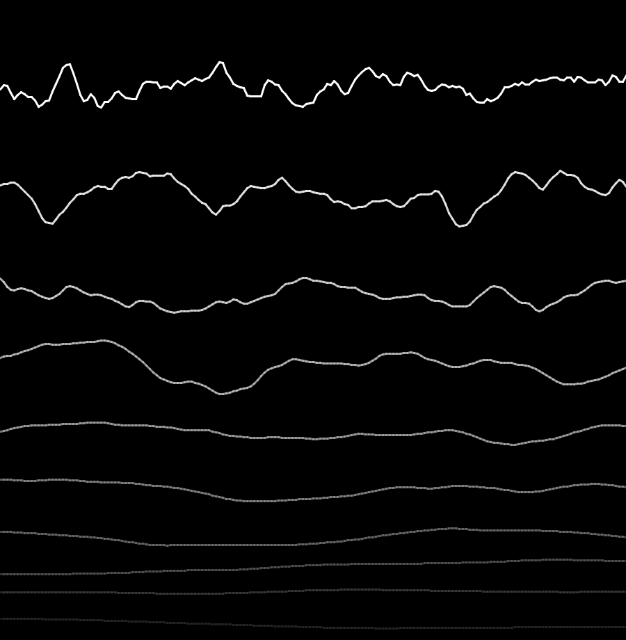
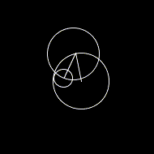

# Generative Art
This is some generative art I've made in Processing and P5js.   
  
## Breathe (Parabolic Curves)
  
  
## Sphere (Line Art)
  

## Levels of Noise (Noise)
  
  
## Pattern Maker (Balls and Sticks)
  
  
## Jewel
  